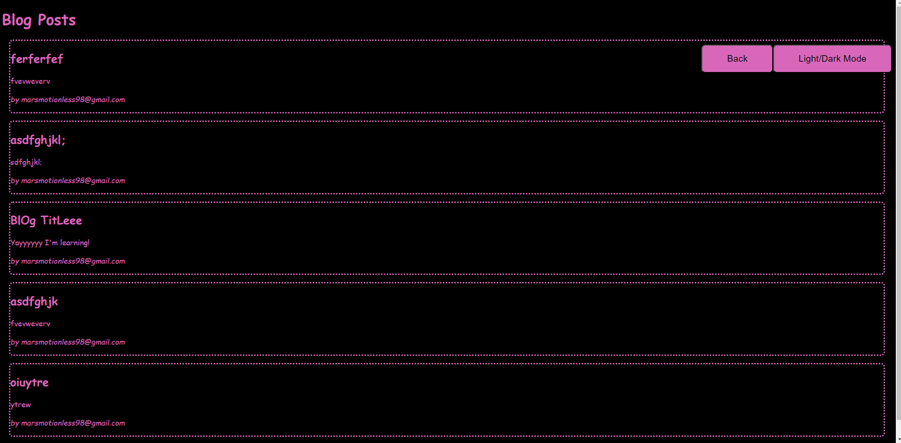
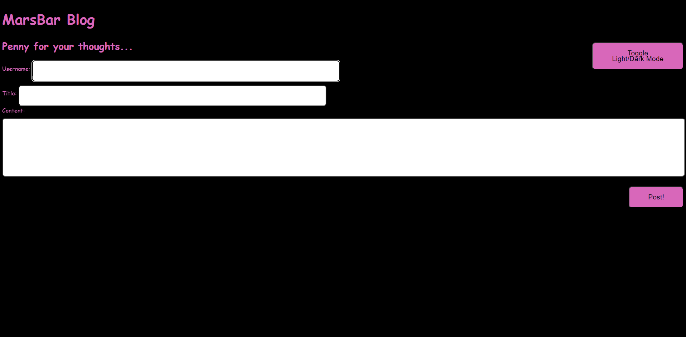
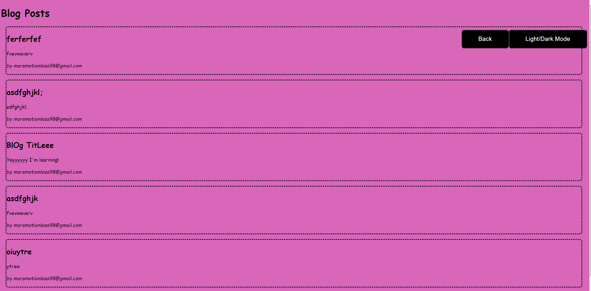
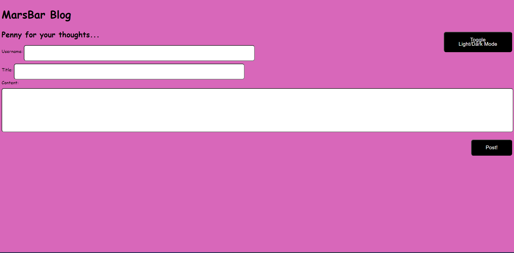

# Challenge-4
Creating a 2-page personal blog site

With creating this personal blog, I'm able to access blog posts stored on a localStorage, submit forms and see blog posts and information about the author of the post.

LINK TO WEBPAGE->>> https://vmarorti.github.io/Challenge-4/

SCREENSHOTS->>>>>>>

